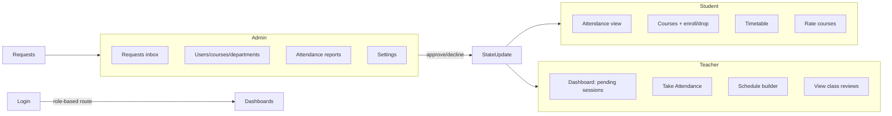
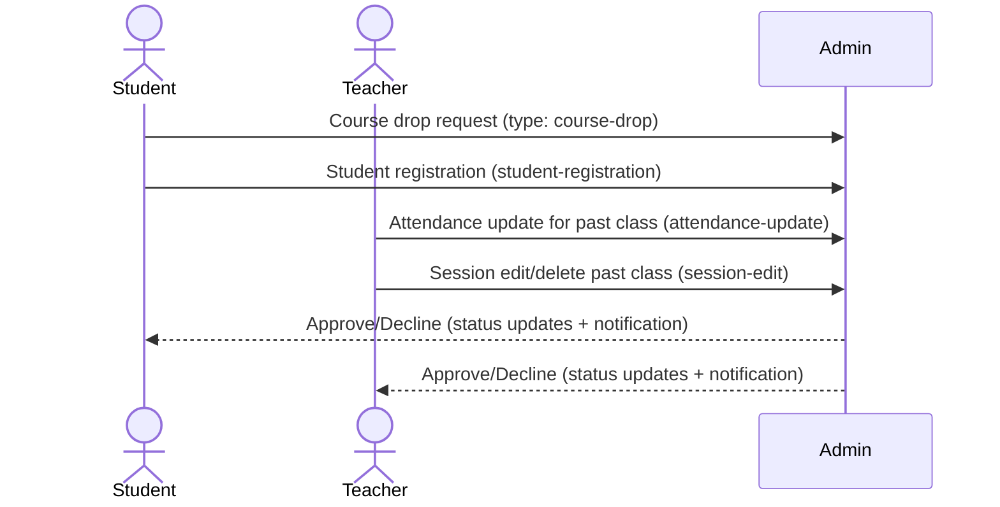

# New Horizon University Attendance ERP

This document explains every feature in plain language and shows how to demo the system end-to-end. It uses mock data with localStorage persistence, so nothing else is required beyond Node and a browser.

> If you only want to run the app: follow “Setup” → “Run locally”. Everything else is feature explanations and demo guides.

## Contents

1. Setup (Node version, install, run, build)
2. High-level map (who does what, quick diagrams)
3. How to demo (scripted flows for each role)
4. Features by role (student, teacher, admin, shared)
5. Approval workflows (how requests move and who can act)
6. Reviews & ratings (who can submit, view, edit)
7. Data model & persistence (what is stored where)
8. Edge cases and guardrails
9. Troubleshooting

## 1) Setup

- Requires **Node 20.19.0+** (pinned in `.nvmrc`). On Windows use nvm-windows; on macOS/Linux use nvm. Commands:

```powershell
cd "c:\Users\smart\Desktop\attendance erp app"
nvm install 20.19.0
nvm use 20.19.0
npm install
npm run dev   # http://localhost:5173 (auto-bumps port if busy)
```

Build/preview:

```powershell
npm run build
npm run preview
```

## 2) High-level map

- Three roles: **Student**, **Teacher**, **Admin**. Each sees tailored navigation and permissions.
- Data lives in Redux slices and is saved to `localStorage` (keys prefixed with `nhu-`). Refreshing keeps state; clearing storage resets to seed data.
- Mock-only app: all “requests” (approvals) are stored in Redux; no real emails are sent.

Mermaid overview:



## 3) How to demo (scripted)

Use the built-in demo logins (on the login page):

- Student: `student@nhu.edu` / `student123`
- Teacher: `teacher@nhu.edu` / `teacher123`
- Admin: `admin@nhu.edu` / `admin123`

Suggested walkthrough (10–15 minutes):

1) **Student journey**
   - Log in as student.
   - Dashboard: point out overall attendance %, today’s classes, per-course chips.
   - Attendance page: filter by course and date; show calendar legend (Present/Late/Absent/Pending/No Class).
   - Courses: enroll in an optional course, submit a drop request for an optional one, rate a course, view all reviews.
   - Timetable: switch days on mobile selector, show grid on desktop.

2) **Teacher journey**
   - Log in as teacher.
   - Dashboard: see “Pending Attendance” count; click “Take Attendance”.
   - Take Attendance: pick session, mark all present, change one student to late, save. Show past class edit flow (requires admin approval).
   - Schedule: add an extra session (overlap protection), browse calendar; open edit/delete on a past session to trigger approval request.
   - Classes: export CSV, open course reviews dialog.

3) **Admin journey**
   - Log in as admin.
   - Requests: approve/decline a course drop, student registration, attendance update, or session edit (statuses update in-line).
   - Users: view students/teachers; Structure: departments/batches; Courses: rating column and edit dialog for any review.
   - Reports: open attendance report view; Settings: confirm mock nature and seed data.

## 4) Features by role

### Shared
- **Authentication**: role-based redirect, persisted session (`nhu-auth-user`).
- **Notifications**: in-app list powered by `notificationsSlice` (created when requests are submitted).
- **Requests**: `requestsSlice` stores approval items with statuses `pending | approved | declined` and approvers (admin by default).

### Student (`pages/student/*`)
- **Dashboard**: overall attendance %, today’s classes (time, room, teacher), absences this month, attendance by course with traffic-light chips.
- **Attendance**: filter by course/date range; table shows date/time/teacher/status/remarks; calendar heatmap with status legend; overall % indicator.
- **Courses**:
  - Enroll optional courses instantly (adds to enrollments).
  - Request drop (creates admin approval request + notification).
  - Rate/feedback per course (submit or edit own review); view all reviews; average rating displayed on cards.
- **Timetable**: weekly view; mobile day selector and desktop 6-column grid; shows date/time/room/teacher per session.

### Teacher (`pages/teacher/*`)
- **Dashboard**: counts courses, today’s classes, pending attendance (sessions today without records); quick CTA to “Take Attendance”.
- **Take Attendance**:
  - Session selector (persisted as active session).
  - Live gate: can only mark during ongoing class; past sessions go through approval flow.
  - Mark-all shortcuts; per-student Present/Late/Absent buttons; save writes records and marks session complete.
  - Past classes list: “Edit Attendance” opens dialog; submission sends “attendance-update” request to admin; shows request status badge.
- **Classes**: for each course see students count, sessions count, average attendance %, preview three sessions, export CSV roster attendance %, view reviews dialog (read-only).
- **Schedule**:
  - Add sessions with frequency (once/twice/weekdays), overlap validation, session type tags, notes.
  - Calendar month grid highlighting weekends; upcoming sessions list.
  - Edit/delete: past sessions require admin approval via “session-edit” request; status chip shown per session.

### Admin (`pages/admin/*`)
- **Requests**: central inbox for all request types (student/teacher registration, course drop, attendance-update, session-edit). Actions: approve or decline; status reflects immediately.
- **Users**: view/manage student and teacher lists.
- **Structure**: manage departments and batches (used in registration form filters).
- **Courses**: table includes average rating column; admin can view and edit any review in dialog; manage course metadata.
- **Attendance Reports**: aggregated attendance summaries and per-course stats.
- **Settings**: clarify mock mode and seeds (no external services).

### Reviews & Ratings (all roles, different permissions)
- Students: submit or edit their own course review (rating + optional comment); see all reviews.
- Teachers: view reviews for their courses (read-only).
- Admin: view and edit any review in course dialog.
- Every course card (student/teacher/admin) shows average rating and count.

## 5) Approval workflows

All approvals are in-app (Redux). Notifications are created for admins on submission.



Behavior notes:
- **Pending** stays until admin acts. No auto-expiry.
- **Approved** requests imply the admin will perform the change; mock app records status only (no external side effects beyond stored status and optional edits).
- **Declined** keeps the request visible with final status for traceability.

## 6) Edge cases and guardrails

- **Attendance editing**: Live classes can be marked directly. Past classes force an approval request and show a status chip so teachers know if it was processed.
- **Schedule overlaps**: Creating sessions checks time conflicts; blocked with a warning.
- **Role defaults**: Unknown routes redirect to each role’s default dashboard; unauthenticated users go to login.
- **Data persistence**: Clearing `localStorage` resets to seed data. Good for demo resets.
- **Ratings**: Students edit only their own review; admin can edit any; teacher is read-only.
- **Enroll/drop**: Core courses cannot be dropped; optional courses create a drop request instead of immediate removal.

## 7) Data model (plain language)

- **Users**: student, teacher, admin. Stored in `adminSlice` mock data; auth stores current user and `status`/`error`.
- **Courses**: belong to departments/batches; have teacherId, credits, schedule summary, and optional flag.
- **Sessions**: class instances with courseId, teacherId, date, start/end, room, type, notes.
- **Enrollments**: studentId + courseId (+ isCore flag).
- **Attendance records**: sessionId + studentId + status (`present | late | absent`) + remarks.
- **Requests**: typed payloads (`course-drop`, `student-registration`, `teacher-registration`, `attendance-update`, `session-edit`) with `approvals` map and `status`.
- **Notifications**: title, description, recipientRole, link.
- **Feedback**: courseId, studentId, rating 1–5, optional comment; used to compute averages.

## 8) Runbook for common demos

- Reset data: clear `localStorage` keys starting with `nhu-`, refresh.
- Create a new student request: on login page “Request Access”, fill form, submit. Log in as admin → Requests → approve/decline.
- Drop optional course: student Courses → Request Drop → admin approves.
- Attendance change for past class: teacher Take Attendance → pick past session under “Past Classes” → edit → submit → admin approves.
- Session edit for past date: teacher Schedule → Edit → submit → admin approves.
- Ratings: student opens course card → Rate/Feedback; teacher views in Classes; admin edits in Courses table dialog.

## 9) Troubleshooting

- Node mismatch: ensure `nvm use 20.19.0` (or Volta/asdf pinned). Vite 7 needs Node 20.19+.
- Port busy: Vite auto-increments; read the console URL. Or run `npm run dev -- --port 5175`.
- Blank data / broken nav: clear `localStorage` (Application tab) then refresh.
- Unable to mark attendance: only during live window. For past classes, use the approval path.
- Overlap error adding session: adjust time or date; overlap guard is strict by design.

---

For quick reference: tech stack is React 19 + TypeScript + Vite 7 + MUI 7 + Redux Toolkit + Day.js; state persists to `localStorage`; everything is mock/offline-friendly.

